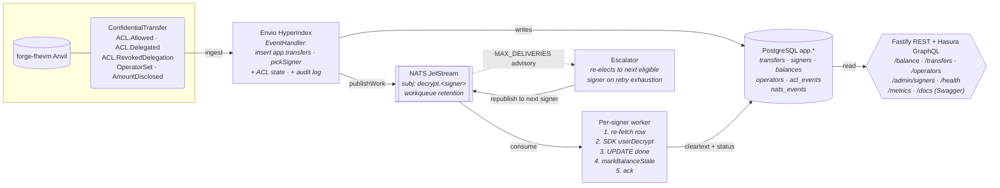
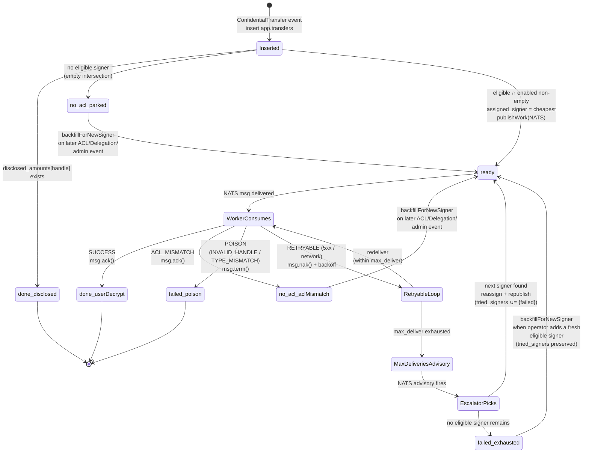
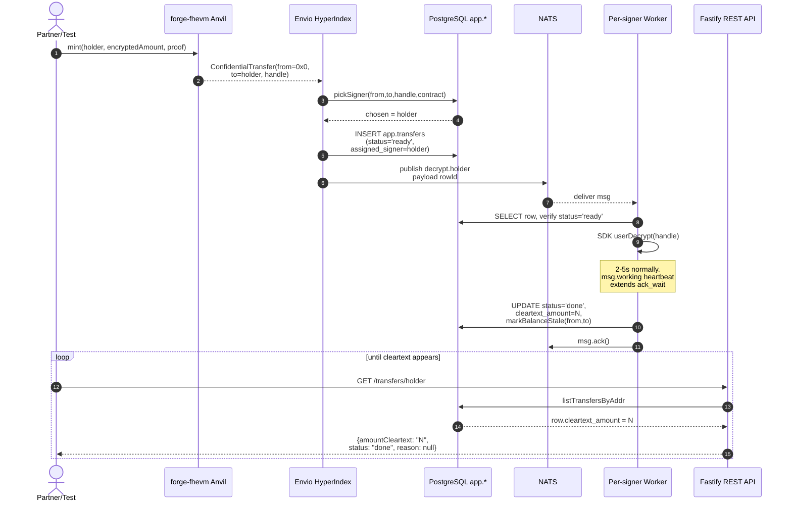
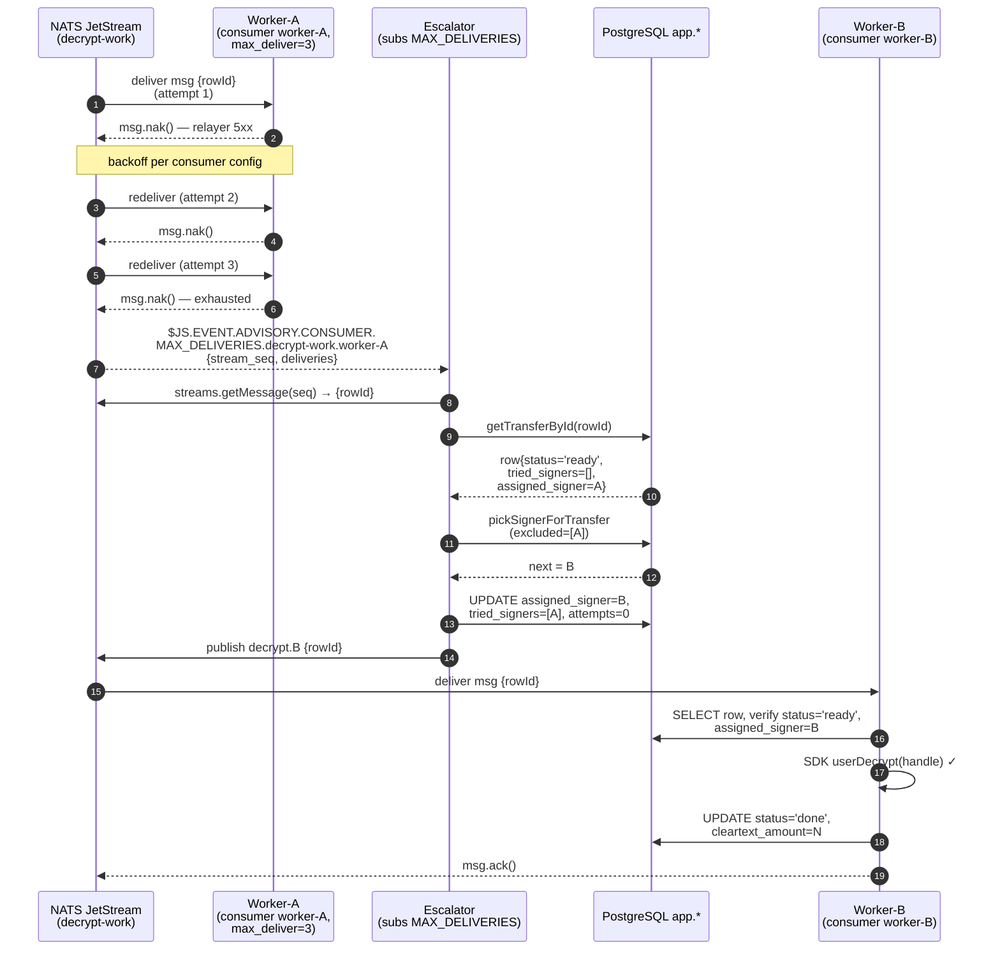

## Should I write this with AI? 

Objective is scaffolding project, OSS sdk -> AI FIT.

## Choice of stack

Clearly node/TS, abstract libraries, heavily push back AI on trying to cut down the corners. My primary push was to use event-driven bus like nats.io instead of plain postgres which Claude would have defaulted to, and Envio as indexer, since I have good experience using it. 

Rest left to ai tool to pick, reviewed package.json after completion -> happy about stable, minimal deps count. 

## Using rest vs gql api

Rest may be simpler to begin with. I do think it could be interesting to extend envio gql queries with decryption logic itself, but that is out of scope. 

## Skip Sepolia testnet

Could do, but spec says one may use local. Local removes whole class of work that can be lean incremented later => skip. 

## API

Keep it simple. I did not prompt it, but for REST, I think it could mirror Etherscan API to make it industry uniform. 

All required endpoints + metrics

## Time-frame

I spent initially around 2 hours in loading context, tuning and planning AI assistant prompt and settings. 

Then run full generation overnight (see details below), used my own sloppoke tooling to do minimal refinement/checks. Then manually inspected results for an hour, caught missing depth of implementation (tests did not do real e2e etc).

Then docs, user facing generation, swagger, checks. 

## Self-reality check

Heavily relying on AI to generate you a solution for job test feels strange. Ran design plan validation across Codex + Gemini to cross-validate via my NSED tooling :) Grounded architectural uncertainties. 

## AI assistance documented

Primary problems were that (as always) it tries to cut corners on large specifications. Scaffolding works great but tests are shallow. Fixed by manual reviews and additional prompts. 

Does not know well (needs context loaded) how to use event-driven bus to save the day. Fixed by supplying documentation.

Leaves slop, fixed with `slop poke` cli :) 

Rest you can find in AI generated section 12 (bottom of this doc)

## Should I bring minimal HTML webpage as part of service?

Tempting. Build live demo indexer. Out of scope - task asks for API service, not a frontend. 


## Handoff

- [x] app launch scripts exist
- [x] Reasonably deep E2E tested
- [x] Manually reviewed tests, api, files
- [x] Docs, readme, integration guide according to Diataxis framework
- [x] Decision log review, hand written part 
- [x] AI assistance documented  
- [x] SDK Feedback given (See below)


------------------------------ AI Generated content below this line-----------------------------------------------
# Architecture

A small service that watches a single ERC-7984 confidential token contract, auto-decrypts amounts the indexer's configured signers have rights on, and exposes cleartext via a REST + Swagger API. Reads from a local fhEVM chain (`forge-fhevm` Anvil), self-hosted Envio HyperIndex for event ingestion, NATS JetStream for decrypt dispatch, PostgreSQL for canonical state.



---

## 0. Mapping to the brief

The brief explicitly leaves three areas open ("your call"):

| Brief asks | This document § | One-line answer |
|---|---|---|
| **Storage** | §1.3, §2 | Postgres canonical; `app.*` schema separate from Envio's `envio`. Two-store split with NATS as pure dispatch. |
| **Throttling** | §6.6 | Three layers, each with a distinct primitive: relayer fairness via NATS `max_ack_pending` (per-signer backpressure), worker-side backoff via JetStream `backoff[]` (configurable per consumer), API-side limits via Fastify's per-route `bodyLimit` + cursor pagination cap. No global throttle. |
| **Awkward in-between states** | §2.3, §4.4, §6.4 | Three distinct null-balance reasons (`never_shielded`/`no_decrypt_rights`/`encrypted_pending`); transfer status enum with `tried_signers` audit trail; cursor pagination reorg-stable; failed rows surfaced not silently dropped. |

The rest of the document is component-choice rationale + scaling + operational surface.

## 1. Component choices

### 1.1 Why Envio HyperIndex (and not hand-rolled `viem` indexing)

Indexing is non-trivial: log paging, reorg replay, head tracking, block-checkpoint resume on restart, schema management. A hand-rolled `viem`-based indexer is ~500+ LOC of fragile code that fails in subtle ways under reorgs or RPC flakiness — exactly the kind of code I should compose, not write.

Envio gives us:
- **HyperSync** for major chains, RPC fallback for custom (we use RPC for chain 31337);
- Typed event handlers generated from `config.yaml` + ABIs (`envio codegen`);
- Self-hosting via the official `docker-compose` pattern (`envio-postgres` + `graphql-engine` + `envio-indexer`);
- BSD-3-Clause license — no commercial blockers for partner self-host;
- `context.isPreload` model gives a clean place to guard side-effects;
- Free Hasura GraphQL endpoint on Envio's own schema.

We dual-write: Envio owns its `envio` schema (for entities + Hasura), we side-load a `postgres.js` client to write to the `app.*` schema where routing, ACL state, and signer config live. Envio's entity ORM doesn't expose raw SQL, and our `pickSignerForTransfer` CTE needs raw SQL.

### 1.2 Why NATS JetStream (and not hand-rolled JS, and not Kafka)

We need an event-driven message bus with durable retry semantics, native time-of-check-to-time-of-use (TOCTOU) handling, and at-least-once delivery. Three options:

**Hand-rolled JS (rejected)** — re-implementing ack-wait, max-deliver-with-backoff, advisory events, `max_ack_pending` backpressure, DLQ semantics is weeks of fragile work. We'd reinvent crash-recovery semantics worse than what NATS already ships. Not a sensible budget.

**Kafka (rejected for this scope)** — heavy: ZooKeeper/KRaft, partition planning, consumer group offset management, log-segment retention tuning. Kafka is optimized for high-throughput streaming with full replay; we need work-queue semantics + advisory eventing for per-message TOCTOU. Kafka has commits but no native ack-wait → you build worker-stuck detection yourself. Operational cost is much higher than NATS for our shape.

**NATS JetStream (picked)** — single binary, file-storage, sub-ms publish-ack, scales to 10⁶ msg/s on commodity HW. Native primitives that map directly to our pipeline:
- `ack_wait` + redelivery for worker-crashed-mid-decrypt;
- `max_deliver` + per-attempt backoff for transient relayer errors;
- `$JS.EVENT.ADVISORY.CONSUMER.MAX_DELIVERIES.>` for cross-signer escalation;
- `msg.working()` heartbeat to extend ack_wait during long decrypts;
- `workqueue` retention (ack removes msg) for hand-off semantics;
- `/jsz` HTTP monitoring endpoint for autoscaling (`consumer.num_pending`).

NATS is lightweight, blazingly fast, and ships exactly the TOCTOU primitives we need off-the-shelf.

### 1.3 PostgreSQL — canonical state

> "PG is truth, NATS is speed."

Two-store split:
- **PG `app.*`** — every transfer, ACL grant, delegation, signer config, balance. Authoritative. Survives NATS data loss.
- **NATS JetStream** — pure dispatch + retry. Stateless w.r.t. business correctness.

When a `ConfidentialTransfer` lands without any held signer eligible, the row goes to `app.transfers` with `status='no_acl'`, **no NATS publish**. The row is durably parked in PG; backfill on three triggers (chain `Allowed`, chain `Delegation`, admin signer add) flips it to `ready` and publishes. This satisfies "events not entitled to decrypt must not be silently dropped" — they're never dropped, they're parked and visible in the API.

#### Why `postgres.js`, not Prisma / Drizzle / TypeORM

We talk to PG via `postgres.js` (tagged-template SQL) — no ORM, no query builder, no schema DSL. Hand-written `.sql` migrations under `src/db/migrations/`. The codebase has one `Sql` type and one `${value}` interpolation convention; learning curve is zero for anyone who already reads SQL.

Why not an ORM:

1. **Supply-chain surface.** Prisma drags in a multi-package runtime (`@prisma/client`, `@prisma/engines`), a native binary query engine downloaded per platform at install time, and a generated client written to `node_modules`. `postgres.js` is one package, ~zero transitive deps, no native binary, no codegen step. This project already runs `minimum-release-age=10080` (7 days) in `.npmrc` for supply-chain hygiene — fewer/smaller deps means fewer publishing accidents to wait out and fewer CVEs to triage. Same logic that ruled out Kafka (§1.2) rules out Prisma.

2. **AI-codability.** SQL is the lingua franca every model is trained on. PSL (Prisma Schema Language), Drizzle's TS DSL, and TypeORM decorators each have their own dialects with their own footguns (Prisma's relation filters vs `where` semantics, Drizzle's `$dynamic()` chaining, TypeORM's lazy-relation traps). A finding like "this join is missing an index" or "this WHERE clause forces a seq scan" is one prompt with raw SQL; with an ORM it's two — translate the abstraction first, then reason. With raw SQL `EXPLAIN ANALYZE` output and the source query are the same language; with an ORM you debug through a translation layer.

3. **Migrations match production tooling.** Plain `.sql` files run by `psql` work identically with Flyway, Goose, sqitch, or a Helm post-install hook. No `prisma migrate deploy` lock-in. The `rollbackAppSchema` reorg path (§5) reuses the same SQL surface — no separate ORM-specific rewrite.

4. **Performance.** `postgres.js` opens a connection pool and runs prepared statements over the wire protocol directly. Prisma routes every query through a Rust query engine (RPC hop) — fine at low volume, observable overhead at high. Indexers are write-heavy: every event is an `INSERT … ON CONFLICT`; we wrote each statement to be one round-trip.

**The tradeoff we accept:** ORMs shine on complex object graphs (deep nested includes, polymorphic relations). Our schema is wide-but-shallow — `app.transfers` joined to `app.signers` / `app.handle_rights_current` / `app.delegations_current` is the deepest join, and `pickSignerForTransfer` (`src/repositories/queries.ts`) is one CTE with four `UNION` branches — exactly the kind of query an ORM either generates inefficiently or forces you to write as raw SQL anyway. We also accept no compile-time type safety on query shape; `TransferRow` interfaces in `src/repositories/queries.ts` are hand-mirrored from the schema. The audit-trail tests (§8c) catch divergence within seconds.

**Where this would flip:** team without SQL fluency, or schema with 50+ tables and nontrivial relation graphs (typical CRUD SaaS). Then Drizzle would be the next stop — TS-native, no native binary, no separate engine.

### 1.4 Fastify REST + Hasura GraphQL

Two HTTP surfaces, both used:

- **Hasura GraphQL** over Envio's `envio` schema. Free with Envio HyperIndex. The Graph is the industry standard for blockchain indexing — partners arrive expecting GraphQL.
- **Fastify REST** over `app.*` (`/balance`, `/transfers`, `/operators`, `/admin/signers`, `/health`, `/metrics`). Built because the routing/escalation/null-reason taxonomy lives in `app.*`, and exposing `app.*` via Hasura would need an additional `track table` metadata step skipped for time. One config step away.

The brief's "ERC-20-style view" describes exposing cleartext values like a vanilla ERC-20 indexer would — not a transport mandate.

### 1.5 `@zama-fhe/sdk@alpha` + `RelayerCleartext` for local

We use `ZamaSDK` + `viem` adapter (`@zama-fhe/sdk/viem`) wrapped behind a thin `ZamaDecryptor` class. The decryptor switches between two relayer transports based on chain id:
- **Chain 31337 (forge-fhevm local)** → `cleartext()` factory → `RelayerCleartext`. No real relayer; decrypts read from the local plaintext DB that forge-fhevm maintains.
- **Sepolia / production** → `node()` factory → real Zama relayer at the configured URL.

We override the SDK's `anvil` chain preset's `network: 127.0.0.1:8545` with the configured `RPC_URL` so the SDK reaches Anvil from inside a docker container.

`any` is used liberally in `decryptor.ts` because the alpha SDK types churn between releases; the runtime contract we depend on is small and well-defined.

### 1.6 `forge-fhevm` (local chain) + ConfidentialToken contract

For local iteration we use `zama-ai/forge-fhevm` vendored as a git submodule under `contracts/forge-fhevm-vendor/`. Its `deploy-local.sh` deploys the fhEVM host contracts (ACL, FHEVMExecutor, KMSVerifier, InputVerifier, HCULimit, PauserSet) at deterministic addresses on a local Anvil.

Our `contracts/src/ConfidentialToken.sol` extends OpenZeppelin's `ERC7984` + `ZamaEthereumConfig` and adds a public `mint(address, externalEuint64, bytes inputProof)`. Deployed via Foundry's `forge script`. OZ confidential-contracts come from npm (`@openzeppelin/confidential-contracts`) because soldeer's git transport fails on the package's recursive submodules; we symlink the npm copy into `contracts/dependencies/`.

### 1.7 `IndexerSigner` — why a custom interface (not viem `Account`, not `ethers.Signer`)

The Signer API is the single most exposed extension point for partners. Wallet partners come with diverse custody backends: Local EOA, Fireblocks vault, AWS KMS, Silence Labs MPC, Turnkey, Privy, Dynamic embedded, in-house HSMs. Forcing them through a viem `Account` or `ethers.Signer` shape constrains them to an SDK we don't control and locks our protocol-side code to that SDK's evolution.

Instead we expose a **minimal two-method interface**:

```ts
interface IndexerSigner {
  readonly kind: SignerKind;
  getAddress(): Promise<Address>;
  signTypedData(args: SignTypedDataArgs): Promise<Hex>;
}
```

This shape is the *intersection* of what every custody backend natively supports:

| Backend | `getAddress` source | `signTypedData` mechanism |
|---|---|---|
| LocalEoa | viem `privateKeyToAccount` | viem `signTypedData` |
| Fireblocks | `GET /v1/vault/accounts/{vaultId}/{assetId}/addresses` | `POST /v1/transactions` op=`TYPED_MESSAGE`, poll until COMPLETED |
| AWS KMS | `GetPublicKey` + keccak | hash EIP-712 client-side via `viem.hashTypedData`, then `kms.Sign(MessageType: 'DIGEST')`, parse DER, recover `v` |
| MPC (Silence Labs, etc.) | party-id → derived address | MPC round-trip on the digest |
| Turnkey / Privy | server-side API call | `signRawPayload` with EIP-712 hash |

Each adapter is ~80–120 LOC of glue. The protocol code (`ZamaDecryptor`, `worker`, `escalator`, picker SQL) is *entirely unaware* of which backend a given signer uses — they're all just addresses with a `signTypedData` method.

**Address is the universal join key** (also §3): every backend's identity collapses onto one Ethereum address. On-chain ACL grants rights to addresses; `app.signers` keys by address; `pickSignerForTransfer` joins on address. Three subsystems agree on one identifier.

**Supply-chain reasoning** — equally important to the abstraction win:

- Each custody backend's SDK is a separate package (`@fireblocks/ts-sdk`, `@aws-sdk/client-kms`, `@silencelaboratories/...`) that we do NOT import at the top of `src/providers/decryptor.ts` or anywhere in hot-path code. Adapters live in their own files (`src/providers/fireblocks.ts`, `aws-kms.ts`) and use **dynamic `await import("...")` inside the constructor**, so the SDK is loaded only when an operator actually enables that signer kind. A Fireblocks-free deployment never resolves `@fireblocks/ts-sdk` — its supply chain doesn't matter.
- Custody SDKs are large, have deep transitive trees, and historically have been targets of supply-chain attacks. Lazy-loading + opt-in means the attack surface scales with the backends you actually use, not the union of every backend the codebase knows about.
- The interface is small enough that a partner can write a custom `IndexerSigner` impl using their internal HSM library, register it as `kind: 'local_eoa'` with a wrapped config, and never need any third-party SDK. The interface contract is what they integrate against — not our concrete adapters.
- Stub adapters (`FireblocksSigner`, `KmsSigner`) throw `not implemented` in their constructor. Even if someone wires up a `kind=fireblocks` row in `app.signers` without the SDK installed, the loader fails fast at signer-construction time, not deep in a decrypt call.

This is in deliberate contrast to the alternative of "pick one SDK, force partners through it" — that approach concentrates supply-chain risk on whichever SDK we picked and forces partners to use the same one.

### 1.8 Supply-chain hygiene (project-wide)

- **`.npmrc` ships `minimum-release-age=10080`** (7 days in minutes; pnpm v10+). Refuses package versions younger than 7 days. Mitigates the compromised-publish attack pattern where a malicious version is pushed, downloaded by automated CI, and detected/taken down within hours-to-days — the 7-day grace window lets ecosystem detection do its work before our installs touch the version. The cost is needing to bump `minimum-release-age=0` for genuine same-week emergencies (acceptable trade).
- **`package.json` pins `packageManager: pnpm@10.0.0`** — corepack-driven, so `pnpm install` uses the exact pinned version even on a fresh machine. Closes the "wrong pnpm version" supply-chain footgun where an older pnpm silently ignores `.npmrc` keys it doesn't understand.
- **All third-party custody SDKs are lazy-loaded** (see §1.7) so they're not in the dependency closure unless used.
- **Hex normalization at the boundary** (`viem.getAddress` for EIP-55 + regex for hex32) prevents malformed-input attacks before they reach SQL CHECK constraints.

---

## 2. Data model & state machine

### 2.1 `app.*` schema overview

```
app.acl_events                — append-only log; replayable
app.handle_rights_current     — per-(handle, account) grant; upsert-only (no revoke event in fhEVM ACL)
app.delegations_current       — per-(delegator, delegatee, contract); has expiration_ts
app.transfers                 — main indexer output; status state machine
app.disclosed_amounts         — handle → cleartext from AmountDisclosed event (free shortcut)
app.operators                 — ERC-7984 operator approvals (plaintext metadata)
app.balances                  — per-address current handle + cleartext + source taxonomy
app.signers                   — operator-managed signer config (addr, kind, cost_rank, enabled)
app.nats_events               — audit log of MSG_TERMINATED/MSG_NAKED/CONSUMER.CREATED/DELETED
app.indexer_state             — single-row indexer head for /health
```

Hex domain types enforce shape at the boundary:
- `app.address` — `VARCHAR(42) CHECK regex '^0x[0-9a-fA-F]{40}$'`; mixed case allowed (EIP-55 validation app-side via `viem.getAddress`)
- `app.hex32` — `VARCHAR(66) CHECK regex '^0x[0-9a-f]{64}$'`; lowercase (handles have no checksum semantics)

### 2.2 Transfer status machine



`no_acl` and `failed_exhausted` are both *recoverable* terminal-looking states — they exit via `backfillForNewSigner` (called from `POST /admin/signers` and from chain `Allowed` / `DelegatedForUserDecryption` events). The distinction:

- `no_acl` resets `tried_signers = []` (no real history to preserve).
- `failed_exhausted` preserves `tried_signers` so the escalator doesn't loop back to the previously-failed signer cohort if the new signer also fails.

Only `failed_poison` is truly terminal — same handle fails identically for any signer, by definition.

### 2.2.1 End-to-end happy path (temporal view)

The state machine above shows *what states exist*. This sequence shows *who hands off to whom and when* on the happy `mint → API serves cleartext` path.



Steps 1–6 are the indexer's commit path; steps 7–11 are the decrypt path; steps 12+ are the partner consumption path. The polling loop terminates as soon as the row reaches `status='done'` — see the [partner polling sequence](./docs/INTEGRATION.md#polling-lifecycle-sequence) for the partner-side view.

### 2.3 Three distinct null-balance reasons

When `GET /balance/:addr` returns `amount: null`, the `reason` field distinguishes:
- `never_shielded` — `confidentialBalanceOf(addr)` returns zero handle. Address has never participated in a shield. Mirrors SDK's `NoCiphertextError`.
- `no_decrypt_rights` — handle exists, no held signer has ACL. Future grant + indexer's backfill triggers will populate cleartext.
- `encrypted_pending` — handle exists, decrypt is enqueued or in flight.

Wallet partner UI renders each distinctly without conflating. This was the brief's hardest unwritten requirement.

---

## 3. Custody-provider extension point

`IndexerSigner` is intentionally minimal:

```ts
interface IndexerSigner {
  readonly kind: SignerKind;
  getAddress(): Promise<Address>;
  signTypedData(args: SignTypedDataArgs): Promise<Hex>;
}
```

Every custody backend differs only in how it signs EIP-712 typed data. Everything else in the userDecrypt flow lives in `ZamaDecryptor`. **Address is the universal join key**:

```
custody-side identifier (vault id, KMS KeyId, MPC party id)
         ↓
   one Ethereum address
         ↓
chain ACL grants rights to address
         ↓
app.signers.addr = same address
```

Implementations:
- `LocalEoaSigner` — viem `privateKeyToAccount` (shipped)
- `FireblocksSigner` — stub with reference contract in JSDoc
- `KmsSigner` — stub with reference contract in JSDoc (AWS KMS ECC_SECG_P256K1)

The interface is the load-bearing piece. Each adapter is ~80–120 LOC of mechanical work; shipping `LocalEoaSigner` proves the contract holds.

---

## 4. Routing & escalation

### 4.1 Unified `pickSignerForTransfer` SQL — one query, three call sites

```sql
WITH eligible AS (
  SELECT $1::app.address AS addr                                  -- from
  UNION SELECT $2::app.address                                    -- to
  UNION SELECT account FROM app.handle_rights_current
    WHERE handle = $3
  UNION SELECT delegatee FROM app.delegations_current
    WHERE delegator IN ($1, $2)
      AND target_contract = $4
      AND expiration_ts > $5
)
SELECT s.addr FROM eligible e
JOIN app.signers s ON s.addr = e.addr
WHERE s.enabled
  AND s.addr <> ALL($6::TEXT[])         -- excluded signers
ORDER BY s.cost_rank ASC
LIMIT 1;
```

Call sites:
| Site | `excluded` | Outcome |
|---|---|---|
| `ConfidentialTransfer` handler | `[]` | cheapest qualified signer, or NULL → `status='no_acl'` |
| Escalator on `MAX_DELIVERIES` advisory | `tried_signers ‖ [failedSigner]` | next cheapest untried |
| Subsequent escalations | grows monotonically | NULL eventually → `status='failed'` |

One indexed query; early-exits via `ORDER BY ... LIMIT 1`.

The **inverse** `backfillForNewSigner` flips `no_acl` rows to `ready` when a new signer becomes eligible (chain `Allowed`, chain `NewDelegation`, or admin signer add).

### 4.2 Per-signer JetStream subjects + pre-assigned signer at publish

Three NATS design iterations during build (see `plan.md` for history):
1. Per-signer subjects + `DeliverPolicy: all` — forced N-way duplicate consume + row-lock dance. **Rejected.**
2. Single subject + worker-pool-loads-all-signers — clean for small N; doesn't scale (memory, rate-limit coordination, cold-start). **Rejected.**
3. **Per-signer subjects + signer pre-assigned at publish (picked).** Each message has exactly one intended consumer — no fan-out duplication. Per-signer rate limit, backoff, DLQ all scoped per signer. Adding/removing a signer = create/delete one consumer.

### 4.3 Native `MAX_DELIVERIES` advisory drives cross-signer escalation

When primary signer exhausts `max_deliver` retries, NATS auto-publishes to `$JS.EVENT.ADVISORY.CONSUMER.MAX_DELIVERIES.<stream>.<consumer>`. Our escalator subscribes to the wildcard subject:

```ts
nc.subscribe('$JS.EVENT.ADVISORY.CONSUMER.MAX_DELIVERIES.decrypt-work.*', async (advMsg) => {
  const adv = advMsg.json();
  const failedSigner = normAddr(consumerToSignerAddr(adv.consumer));
  const original = await js.streams.getMessage('decrypt-work', { seq: adv.stream_seq });
  const { rowId } = JSON.parse(original.data);
  // ... re-elect via pickSignerForTransfer with excluded=[tried_signers, failedSigner]
  // ... republish to decrypt.<next>
});
```

No custom DLQ table, no cron, no polling — pure event-driven dispatch. Bugs found+fixed during build: lowercase-vs-checksum exclusion (escalator looped 3300+ times re-electing the same signer); idempotency check against stale advisories.

#### Escalation rescue sequence

A walkthrough of the multi-signer rescue. Worker-A is fault-injected via `MOCK_FAILING_SIGNERS`; Worker-B is healthy. Both hold ACL on the handle.



The escalator's `excluded=[A]` is the load-bearing detail — it filters the failed signer out of `pickSignerForTransfer`'s eligibility CTE, so a degraded signer doesn't get re-elected on the same row. If `pickSignerForTransfer` returns null (no alternative), the row goes to `status='failed'` with `reason='all_signers_exhausted'` (queryable via `/transfers`, and *not* silently dropped). This state is **recoverable**: when an operator later adds a fresh eligible signer via `POST /admin/signers`, `backfillForNewSigner` flips the row back to `ready` with `tried_signers` preserved (see §2.2 state diagram).

### 4.4 Poison handling

`msg.term()` does NOT trigger `MAX_DELIVERIES` (it fires `MSG_TERMINATED`). Poison is per-handle terminal — fails identically for any signer. Worker writes `status='failed'` in PG before `msg.term()`; escalator skip is correct, not lossy.

---

## 5. ACL state

`fhevm-host/ACL.sol` events used:
- `Allowed(caller, account, handle)` — persistent grant; **no `Disallowed` event**. Once granted, persists. `app.handle_rights_current` is upsert-only.
- `DelegatedForUserDecryption(delegator, delegate, contractAddress, delegationCounter, oldExpirationDate, newExpirationDate)` — per-(delegator, delegate, contract) **with expiration**. Schema stores `expiration_ts`; queries filter `WHERE expiration_ts > now()`.
- `RevokedDelegationForUserDecryption(delegator, delegate, contractAddress, delegationCounter, oldExpirationDate)` — sets `expiration_ts = 0`.

ACL race window: indexer believes signer X has rights at time T (`Allowed` event seen), worker calls `userDecrypt` at T+30s, chain `Disallowed` X at T+10s. Relayer returns `ACL_MISMATCH` → worker drops row to `no_acl`, trusts chain, awaits future grant.

---

## 6. Operations & observability

### 6.1 `/health` — liveness + NATS state

Returns indexer head, transfer status counts, and live NATS stream stats (polled from `/jsz` with 1.5s timeout, returns `null` on unreachable so partial outage doesn't fail the endpoint):

```json
{
  "ok": true,
  "indexer": { "lastBlock": 1234, "updatedAt": "..." },
  "counts": { "done": 6, "ready": 0, "noAcl": 0, "failed": 0 },
  "nats": {
    "stream": "decrypt-work",
    "messages": 10899,
    "bytes": 1013607,
    "consumers": [
      { "name": "worker-0xf39f...", "numPending": 0, "numAckPending": 0, "numRedelivered": 0, "numWaiting": 0 }
    ]
  }
}
```

### 6.2 `/metrics` — Prometheus

`# HELP` + `# TYPE` lines + gauges:
- `confidential_indexer_transfers_total{status="done|ready|no_acl|failed"}`
- `confidential_indexer_signers_enabled`
- `confidential_indexer_last_block`
- `nats_stream_messages{stream}`, `nats_stream_bytes{stream}`
- `nats_consumer_num_pending{stream,consumer}` — primary HPA signal
- `nats_consumer_num_ack_pending{stream,consumer}`
- `nats_consumer_num_redelivered{stream,consumer}`

NATS gauges omit cleanly when `/jsz` unreachable; PG gauges always present.

### 6.3 `app.nats_events` — NATS audit log

Dedicated worker (`src/worker/audit.ts`) subscribes to four advisory wildcards:
- `$JS.EVENT.ADVISORY.CONSUMER.MSG_TERMINATED.>`
- `$JS.EVENT.ADVISORY.CONSUMER.MSG_NAKED.>`
- `$JS.EVENT.ADVISORY.CONSUMER.CREATED.>`
- `$JS.EVENT.ADVISORY.CONSUMER.DELETED.>`

Writes `(ts, kind, subject, stream, consumer, stream_seq, deliveries, payload jsonb)` rows. Partner forensics SQL:

```sql
SELECT * FROM app.nats_events
WHERE consumer='worker-0xabc' AND kind='msg_naked'
ORDER BY ts DESC LIMIT 50;
```

Indexed by `(ts)`, `(consumer, ts)`, `(kind, ts)`.

### 6.4 Cursor-paginated `/transfers/:addr` — reorg-stable

Opaque cursor encodes `(block, log_index, tx_hash)` via base64url. Query predicate is lexicographic `(block, log_index) < (cursorBlock, cursorLogIndex)` which is **inherently reorg-stable**: even if the cursor's specific row is reorged out, "older than this point" remains a monotonic predicate over the post-reorg history. `tx_hash` is carried for forensics + boundary verification.

```
GET /transfers/:addr?limit=50&cursor=<opaque>&direction=in|out|both
→ { items: [...], limit, count, nextCursor, hasMore }
```

`nextCursor` is `null` when fewer than `limit` rows return (last page). Malformed cursors are silently treated as "first page" — client doesn't get 400 for a stale cursor format.

### 6.5 Throttling — three layers, three primitives

The brief asks specifically about throttling. We push back at three layers, each using the right primitive for that layer:

**Layer 1 — Relayer fairness (per-signer NATS backpressure)**
Each per-signer consumer has `max_ack_pending: 32`. NATS refuses to deliver more than 32 unacked messages to that signer's worker. If signer A's relayer is slow, A's worker pulls in chunks of ≤32; A doesn't drag down B's signer's throughput. This is the protection that matters most under load — one slow relayer can't starve the others.

**Layer 2 — Retry burst control (per-message JetStream backoff)**
On retryable errors (relayer 5xx, network), worker calls `msg.nak()`. NATS reschedules redelivery with the consumer's `backoff: [1s, 5s, 30s]` array. Exponential-ish backoff is enforced by the bus, not by the worker — no busy-waiting, no thundering herd when relayer recovers.

**Layer 3 — API ingress caps (Fastify route schemas)**
`/transfers/:addr` query schema caps `limit: { maximum: 200 }`. Cursor pagination forces partners through bounded page sizes — no `?limit=10000` outliers. Future: per-IP rate limit via `@fastify/rate-limit` middleware if partners begin polling aggressively.

**No global throttle.** Two reasons:
- A global limit hurts the wrong workload — a stuck partner can starve healthy traffic.
- Per-layer primitives are already there (NATS, Fastify schemas). Adding a third orchestrator is reinventing what the bus + framework already do.

What's **deliberately not** wired:
- **Per-signer rate limit at the worker level** — relevant only after the shared-pool rewrite (>500 signers), where one shared worker pool can't rely on per-signer NATS consumer isolation. See §7.2.
- **Per-partner API throttling** — no partner-identity layer yet; deploy behind partner gateway per README.

### 6.6 `/admin/signers` — self-service signer management

```
POST /admin/signers { addr, kind, costRank, config }
DELETE /admin/signers/:addr
```

`POST` upserts the signer row, runs `backfillForNewSigner` (always, even if NATS down — PG state must stay correct under partial outage), then best-effort ensures the NATS consumer and publishes wake-ups for newly-ready rows. Returns `{ addr, backfilled, natsError }`.

`DELETE` sets `enabled=FALSE`. Escalator naturally reassigns rows still in `ready` for that signer at next failure (advisory-driven, not eager).

---

## 7. Scaling

### 7.1 Where this breaks (bottleneck ladder)

The submitted design is correct for **1–500 signers**. Beyond that, three bottlenecks compound:

| Scale | Bottleneck | Why |
|---|---|---|
| ~200 signers | SDK instantiation. Each `ZamaDecryptor` spins a `RelayerNode` with Node `worker_threads` for FHE WASM (~50–100 MB per pool). | Share one SDK; inject `ViemSigner` per call. |
| ~500 signers | PG connection pool contention. `max: 10` × N async loops. | Bump to ~50; add PgBouncer in transaction-pooling mode beyond ~2k. |
| ~5,000 signers | NATS consumer cardinality. Each consumer is a raft-quorum write on add/remove; filter-subject index grows. | Architectural flip (next section). |

### 7.2 The shared-pool rewrite (>500 signers)

Net ~110 LOC change:

```
- per-signer JetStream consumers  → shared `decrypt.work` subject + queue group of K workers
- per-signer worker loop          → shared worker pool reads `assigned_signer` from row
- one SDK per signer              → shared SDK + LRU of per-signer signer-contexts (K=20)
+ liveness sampler (new ~60 LOC)  → background probe every 10s + opportunistic worker votes
                                     (every decrypt success/fail bumps signer_health)
+ reaper (new ~50 LOC)            → on signer-down (PG NOTIFY), reassigns rows stuck on dead signer
- per-signer NATS rate limit      → moves into worker (token bucket keyed on assigned_signer)
- per-signer DLQ                  → single DLQ; escalator reads row.assigned_signer
```

Race to watch: reaper flips `assigned_signer=null` while worker holds in-flight decrypt. Fix via compare-and-swap on final write: `UPDATE … WHERE assigned_signer=$primary` — rowcount=0 → ack and let the new assignee redo.

### 7.3 Infra horizontal scaling (orthogonal to the rewrite)

| Tier | Scaling mechanism | Limit |
|---|---|---|
| API | ALB + ASG (CPU + p95 latency triggers). Stateless. | PG read connections @ ~10× replicas |
| Worker | NATS queue-group; K replicas share work atomically. HPA on `nats_consumer_num_pending`. | SDK worker_threads CPU per pod |
| Envio | Single-replica per chain (writes monotonic head). Vertical scale only. | PG IOPS |
| Escalator | Single-replica (advisory rate is per-minute, not throughput). | n/a |
| NATS | R=3 cluster baseline; R=5 beyond ~50k msg/s. Separate volumes per node. | n/a |
| Postgres | Primary + 2 read replicas. API + balance-refresh on replicas; envio + decrypt-worker on primary. | Vacuum/bloat at very large `transfers` tables |

**Composition**: ALB+ASG absorbs **throughput**; the rewrite absorbs **signer count**. 10k signers + 1M tx/day needs both.

---

## 8. Tests

```
test/unit/hex.test.ts                13 tests   EIP-55 normalize, hex32 lowercase, type guards, zero detection
test/unit/cursor.test.ts              7 tests   base64url cursor encode/decode, malformed input handling
test/sql/pick_signer.test.ts         15 tests   forward + inverse picker (11 forward + 4 inverse cases)
test/sql/negative_retry.test.ts       3 tests   escalator lifecycle: CHEAP → MID → PRICEY → failed
test/sql/audit.test.ts                4 tests   nats_events insertions + partner forensics queries
test/sql/rollback.test.ts             7 tests   reorg cleanup via Envio's onRollbackCommit callback
test/sql/happy_api.test.ts           68 tests   API surface (against live Fastify in-process):
                                                  - 23 happy-path (balance/transfers/operators/health/metrics/admin)
                                                  - 25 address-validation rejections (5 bad-addr × 5 routes)
                                                  - 7 Fastify schema rejections (limit bounds, enum, neg costRank)
                                                  - 3 empty-state surface (not_observed / empty page / [])
                                                  - 3 admin corners (idempotency, 404, audit-preserving disable)
                                                  - 3 mid-state taxonomy (failed/ready/no_acl → reason mapping)
                                                  - 4 cursor edges (past-end, count<limit, full-page probe)
test/e2e/full_pipeline.test.ts        7 tests   FULL stack: chain → Envio → NATS → worker → REST API
                                                  every test mints/transfers on anvil and polls a running
                                                  Fastify `GET /transfers/:addr` until cleartext appears.
                                                  No piece mocked. Driven by scripts/e2e.sh which brings
                                                  up the entire docker compose stack before vitest runs.
                                              ──────
                                              124 tests
```

The e2e suite is the load-bearing claim that "an event going in produces the right cleartext coming out of the API." It does NOT call `ZamaDecryptor.decrypt()` directly; the test mints on chain, lets Envio's `EventHandler` write `app.transfers` and publish a NATS msg, lets the worker consume + decrypt + write back, then polls `GET /transfers/:addr` via the real Fastify server until `amountCleartext` is populated (or the expected `status='no_acl'` / `'failed'` lands). The unhappy variants (`alice→bob` with neither registered → `no_acl`; insufficient-balance → `amountCleartext='0'`) prove the negative paths through the same surface partners hit.

Three live pipelines validated beyond the test suite:
- **Host-services**: Anvil + `envio dev` + worker + API. Mint via SDK → envio handler runs picker → publishes NATS → worker consumes → SDK userDecrypt → `app.transfers.status='done'` with `cleartext_amount=9999`. API responds `{amount:"9999", source:"decrypted"}`.
- **Multi-signer escalation**: two signers in `app.signers`; cheap fault-injected via `MOCK_FAILING_SIGNERS` env. Live mint → cheap fails `max_deliver` → MAX_DELIVERIES advisory → escalator re-elects expensive → succeeds. Row: `status='done', tried_signers=[<cheap>], assigned_signer=<expensive>`.
- **`docker compose up` + scripts/e2e.sh**: 8 containerized services per Envio self-host pattern (envio-postgres, graphql-engine, envio-indexer, nats, api, worker, escalator, balance-refresh, nats-audit). One-shot orchestration: brings up anvil + contracts, `docker compose up -d --build`, runs `pnpm test test/e2e` against the live stack. 7/7 pass in ~6s of vitest time.

---

## 9. What's cut or deferred

**Cut deliberately** (justified in line):
- Fireblocks / AWS KMS / Silence Labs / Turnkey adapters — interface is the contract; stubs throw `not implemented`. Each adapter is ~80–120 LOC of mechanical work.
- Multi-contract support — single `TOKEN_ADDRESS` env var; schema supports multi.
- Auth on API — README documents "deploy behind partner gateway".
- Per-handle ACL revocation — fhEVM has no `Disallowed` event; not modeled.
- Reorg handling beyond Envio defaults — Envio rolls back; idempotent upserts make it safe.
- Sepolia run — documented in README, never executed per scoping guidance.

**NATS roadmap** (effort estimates from §6 audit):
- `tools/rebuild-stream.ts` PG→NATS recovery (~50 LOC) — republish from `app.transfers WHERE status='ready'` for disaster recovery.
- `STREAM.PURGE` admin endpoint (~20 LOC) — ops drain.
- `METRIC.CONSUMER.ACK` subscriber (~40 LOC) — p99 ack-latency histogram for SLO dashboards.
- `STREAM.LEADER_ELECTED` / `QUORUM_LOST` subscribers (~30 LOC) — required at R≥3 cluster.
- `MSG_NAKED` → in-process liveness vote — needs the shared-pool rewrite.
- NATS Services framework (~150 LOC) — only if internal req/reply callers appear.

---

## 10. Reflection — what breaks first under partner load

The **decrypt worker's `msg.working()` heartbeat under a slow relayer** is the piece I'd want to load-test before partner ships.

```ts
const keepalive = setInterval(() => msg.working(), 15_000);
try {
  const cleartext = await decryptor.decrypt(handle);   // 2–5s normally, ?? on slow relayer
  await sql.begin(async (tx) => { /* PG writes */ });
  msg.ack();
} finally {
  clearInterval(keepalive);
}
```

What breaks first:
1. **Slow relayer + many in-flight messages**: per-signer consumer has `max_ack_pending: 32`. If 32 decrypts pending and relayer slow (30s tail latency), `ack_wait` expires on worst messages, NATS redelivers — now 32 deliveries plus 32 retries fighting the same relayer. Tail-latency-driven redelivery storms are sneaky.
2. **Worker thread starvation**: SDK's `RelayerNode` uses `worker_threads` for WASM. Pool of K workers × N signers × M concurrent decrypts could oversubscribe CPU.
3. **PG transaction held during decrypt**: `sql.begin(async (tx) => { decrypt then write })` would hold a connection during decrypt. Current code awaits decrypt OUTSIDE the tx (✓), but a careless change would hit pool exhaustion under burst.

**How I'd prove it**:
- k6 against the worker pool with mocked relayer that 503s 20% of the time + 200ms–10s latency tail.
- Monitor: indexer head advance (monotonic), PG connection pool depth, `nats_consumer_num_pending`, `nats_consumer_num_redelivered`, p99 cleartext-write latency.
- Pass criteria: head advances ≥ 1 block/s under sustained load, zero duplicate cleartext rows, escalation latency p99 < 90s.

---

## 11. SDK feedback

1. **`@zama-fhe/sdk` should ship a `Signer` reference impl for server-side custody** (Fireblocks / KMS / MPC). Every backend integrator re-writes the same EIP-712 → relayer wrapper. The published `ViemSigner` is browser-shaped. A `@zama-fhe/sdk/custody` subpath with a thin `Signer` interface + reference adapters would save days across the ecosystem and head off subtle EIP-712-encoding mistakes per integrator. *Priority 1 — partner integration unblocker.*

2. **Stable error taxonomy on `userDecrypt`**: distinct exception classes for `ACL_MISMATCH` (chain says no), `RELAYER_5XX` (transient), `INVALID_HANDLE` (poison), `TYPE_MISMATCH` (poison), `DELEGATION_NOT_PROPAGATED` (transient/retry). Currently distinguishing these requires string-matching `err.message` (see `src/providers/decryptor.ts` `isAclMismatch` / `isPoison`). An indexer that gets retry policy wrong because of brittle string matching is a real footgun. *Priority 2.*

3. **`@zama-fhe/sdk/cleartext` should have its own documented entry-point for local fhEVM dev** that bypasses the relayer entirely. The `cleartext()` factory exists in the package but I had to read the SDK source to find it (took 30+ min). A `ZamaSDK.cleartext({ rpcUrl })` constructor or one-paragraph guide would eliminate the "does this even work locally" friction. *Priority 3.*

Bonus footgun: **`anvil` FheChain preset hardcodes `network: 127.0.0.1:8545`** which is unreachable from inside Docker containers (it resolves to the container itself). I worked around with `{ ...sdkMod.anvil, network: process.env.RPC_URL }`. Either let the network field be overridable via env or document the docker gotcha.

---------- Manually added text ------------ 


4. Rendered docs link should be added to GitHub right side panel (project links) https://docs.zama.org/protocol , otherwise it adds confusion — reader might go to /docs/ but there is no human-friendly index. Adding an index there wouldn't hurt either.

5. `/claude-setup` directory is for developing THE SDK; this should live in a parent repository that is private to Zama. The SDK is a user-facing document — `/claude-setup` should instead describe SKILL & Plugin setup for *consuming* the SDK. 

6. I did not interact with React implementation part, taking a quick look at it, seems reasonably correct - uses provider/hook structure, neat. 

7. **Backend integrators have a thin path today.** The current Zama SDK is a TS+WASM wrapper around `tfhe-rs`/`tkms` (both Rust crates compiled via wasm-bindgen). The pattern works beautifully for JS consumers — proven by the `./viem`, `./ethers`, and `./query` (TanStack Query factories = the actual "React SDK") adapters that all compose cheaply on top of the TS core. But a Rust/Go/Python backend integrator can't reuse any of that orchestration. They get either: (a) wrap the JS-shaped WASM clumsily via wasmtime (slower, awkward ABI, all the orchestration still lives in JS), or (b) re-derive every EIP-712 message + KMS protocol detail from the TS source by hand (error-prone, silent ACL failures on subtle bugs).

   **The cheap defensive ask: publish the relayer wire protocol spec once the protocol exits alpha.** Request/response JSON shapes, EIP-712 typed-data structures, KMS share-combining algorithm — with the same rigor as the Solidity ABI. Cost to Zama: a documentation sprint. Unlock: Rust, Go, Python, Elixir get thin clients written by people who use those languages daily, against a stable contract. Stripe model — most of their language SDKs aren't even Stripe-maintained. This is the right preparation for the day backend-integrator demand crosses a worth-engineering-against threshold.

   **The premium ask** — a Rust orchestration crate at the foundation that the JS SDK wraps via wasm-bindgen — is probably wrong as a current priority. It's a multi-quarter refactor to help a cohort that's a small fraction of users today. Worth periodic re-evaluation as confidential-token backend tooling accretes (custodians, indexers, MEV); not worth pushing now.

   **Why this still matters for our indexer specifically**: the decrypt worker is the hot path, and TFHE decrypt currently spends most of its wallclock in wasm-bindgen marshaling + V8 GC rather than in actual TFHE math. The day Zama specs the wire protocol, rewriting `src/worker/main.ts` in Rust against `tfhe-rs` + the documented relayer protocol could plausibly double throughput per worker.


---------- END of Manually added text ------------

---

## 12. AI assistance

I drove this build through Claude Code with explicit `/loop 20m` self-pacing and a `uncertain.md` log the user reviewed periodically. The dialog drove three full architectural rewrites in the design phase before any code (per-signer fan-out → single-subject work-queue → per-signer with pre-assignment). Each rewrite was triggered by the user's pushback ("won't scale with many signers", "why cron when NATS has advisory events", "why row-lock when ack-when-done is canonical") — Claude proposed → human pushed back → Claude conceded specific points → plan tightened. That iteration shows up directly in the code: zero polling components in the worker, zero manual DLQ tables, the unified `pickSignerForTransfer` CTE.

**Three subtle things Claude got wrong and the user caught:**

1. **BYTEA columns for addresses and hashes.** Technically optimal for storage but a 45-minute Buffer↔hex bug-hunt waiting to happen given that viem, the SDK, and Envio all flow `0x...` strings end-to-end. Switched to TEXT with CHECK constraints.

2. **`revoked_at_block IS NULL` in eligibility filters.** Modeled per-handle ACL revocation. Then read fhEVM ACL source and found there's no `Disallowed` event — once granted, persists. Dropped the `active` flag from `handle_rights_current` entirely.

3. **Per-signer subjects with `DeliverPolicy: all` for "free replay on new signer."** Sounded elegant. User caught that it forced N-way duplicate consume when an indexer holds multiple signers, which I patched with a row-lock dance. User called out the row-lock as a code smell ("fighting NATS's natural model"). Went canonical: single intended recipient per message via pre-assigned signer at publish time. Native MAX_DELIVERIES advisory handles cross-signer escalation.

A fourth: GraphQL vs REST framing in the original DECISIONS.md projected REST preference onto the brief. User caught that the brief never says REST; The Graph (industry standard) IS GraphQL.

A fifth, late in the build: **AI delivered the initial e2e suite as SDK round-trip only — chain → `ZamaDecryptor.decrypt()` → assert.** No REST API call, no Envio, no NATS, no worker. The headline "an event going in produces correct cleartext coming out of the API" claim was *asserted by architectural narrative, not exercised by code*. User caught this directly ("in the e2e test suite you are not testing actual API, nor you are testing actual NATS … you should tx on chain → query on rest API"). The fix was substantial: rewrite all 7 tests to mint/transfer on chain → poll `GET /transfers/:addr` against a running Fastify against a running compose stack (envio-indexer + nats + worker + api). The lesson generalizes: when an AI says "the load-bearing claim is X," check whether the test actually traces the X path or just touches one node on it. Test-coverage narrative is exactly the place where confirmation bias hides.
