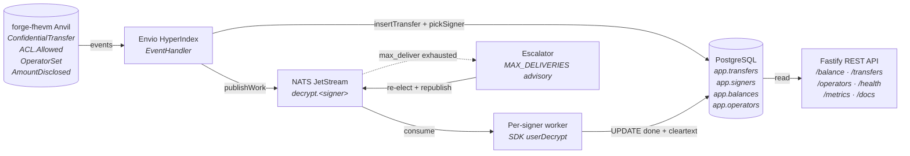

# Confidential Indexer

A small TypeScript service that watches a single ERC-7984 confidential token contract, auto-decrypts amounts the indexer's configured signers have rights on, and exposes the cleartext via REST + OpenAPI. Built for the Zama Protocol take-home.



Three null-balance cases surface explicitly: `never_shielded`, `no_decrypt_rights`, `encrypted_pending`. Events the indexer can't yet decrypt are durably parked as `no_acl` and backfilled when ACL grants land — they're never silently dropped.

---

## Where to go next

- **[docs/INTEGRATION.md](./docs/INTEGRATION.md)** — Wallet partners + integrators. Endpoints, null-reason taxonomy, pagination loop, TypeScript types, error shapes.
- **[docs/openapi.json](./docs/openapi.json)** — Static OpenAPI 3.0 spec. Feed to your codegen.
- **[DECISIONS.md](./DECISIONS.md)** — Architecture rationale. Why NATS over Kafka, why postgres.js over Prisma, the supply-chain stance, what breaks under partner load.
- **`http://localhost:3000/docs`** — Live Swagger UI once the stack is running.

---

## Dev quickstart

### Prerequisites
- macOS or Linux
- Node 22+, pnpm 10+
- Foundry (`forge`, `cast`, `anvil`) — [install](https://book.getfoundry.sh/getting-started/installation)
- Docker + Docker Compose

### One-shot setup
```bash
git clone --recurse-submodules <this repo>
cd sdk-triage
pnpm install
cp .env.example .env.local
```

### Run tests (no chain required)

```bash
pnpm test       # 117 unit + SQL tests (~10s, disposable Postgres via testcontainers)
```

### Run the full E2E suite (chain + Envio + NATS + worker + API)

```bash
./scripts/e2e.sh
# Brings up anvil + contracts, runs `docker compose up -d --build`, then
# `pnpm test test/e2e`. 7/7 against the live stack in ~6s of vitest time.
# Add --teardown to tear down after.
```

### Run the live pipeline for iteration

```bash
./scripts/start-anvil.sh                # anvil + fhEVM host + ConfidentialToken
docker compose up -d                    # envio-postgres + hasura + envio + nats + api + worker + escalator + balance-refresh + nats-audit
curl -X POST http://127.0.0.1:3000/admin/signers \
  -H 'content-type: application/json' \
  -d '{"addr":"0xf39Fd6e51aad88F6F4ce6aB8827279cffFb92266","kind":"local_eoa","costRank":0,"config":{"privateKeyEnv":"INDEXER_PRIVATE_KEY"}}'
open http://localhost:3000/docs
```

The worker self-restarts via compose's `restart: unless-stopped` policy; once the signer is registered, the next worker boot picks it up and begins consuming.

---

## Repo layout

```
sdk-triage/
├── contracts/                            Foundry project + ConfidentialToken.sol
├── envio/                                Envio HyperIndex v3 config + handlers
├── src/
│   ├── api/
│   │   ├── server.ts                     Fastify + @fastify/swagger bootstrap
│   │   └── routes/                       One file per resource (health, metrics,
│   │                                     balance, transfers, operators, admin)
│   ├── services/                         Multi-step orchestration (signer admin)
│   ├── repositories/                     SQL — all queries live here
│   ├── worker/                           main, escalator, balance-refresh, audit
│   ├── nats/                             Stream + monitoring helpers
│   ├── providers/                        IndexerSigner interface + impls
│   ├── db/                               postgres.js client + migrations
│   └── util/hex.ts                       EIP-55 + hex32 helpers
├── scripts/
│   ├── start-anvil.sh                    Anvil + host + token deploy
│   └── e2e.sh                            One-shot full-stack e2e orchestration
├── test/
│   ├── unit/                             20 tests (hex, cursor)
│   ├── sql/                              97 tests (routing, API, audit, rollback)
│   └── e2e/                              7 tests, full stack
├── docs/
│   ├── INTEGRATION.md                    Partner-facing API guide
│   └── openapi.json                      Static OpenAPI spec
├── Dockerfile / docker-compose.yml
├── DECISIONS.md
├── plan.md                               Design narrative
└── uncertain.md                          Uncertainty log
```

---

## Sepolia (documented only — not run in this submission)

Per the brief's scoping guidance, this submission focuses on the local forge-fhevm path. To run on Sepolia:

1. Fund an EOA on Sepolia and get a Zama Relayer API key.
2. Deploy `ConfidentialToken` to Sepolia.
3. Set in `.env.local`: `RPC_URL`, `CHAIN_ID=11155111`, `TOKEN_ADDRESS`, `ACL_CONTRACT_ADDRESS`, `RELAYER_API_KEY`, `INDEXER_PRIVATE_KEY`.
4. Update `envio/config.yaml` `networks.id` to `11155111`; reset Envio state.
5. `docker compose up -d`.
