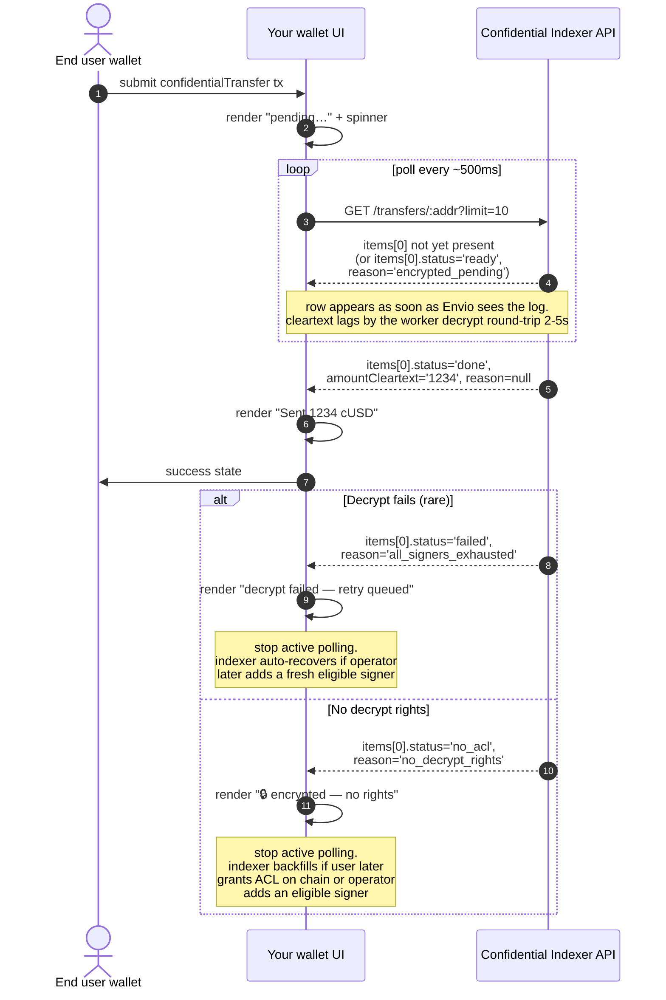

# Partner integration guide

How to consume the Confidential Indexer REST API from a wallet, dashboard, or analytics backend.

This service watches a single ERC-7984 confidential token contract, decrypts amounts on your behalf (using signer keys you authorize it to use), and exposes the cleartext via HTTP. You query by address — the universal join key — and get either a number, or an explicit reason the number is null.

- **Live OpenAPI:** `http://<host>:3000/docs` (Swagger UI)
- **Static spec:** [`openapi.json`](./openapi.json) — feed to any codegen tool
- **Architecture rationale:** [DECISIONS.md](../DECISIONS.md)

---

## Mental model: three states, three reasons

For every address the indexer has observed, a `GET /balance/:addr` or `GET /transfers/:addr` response carries one of three shapes:

| `amount` (or `amountCleartext`) | `reason`                  | What it means                                                                                          |
| ------------------------------- | ------------------------- | ------------------------------------------------------------------------------------------------------ |
| `"42"` (decimal string)         | `null`                    | Decrypted. Render the value.                                                                           |
| `null`                          | `"never_shielded"`        | Address holds no encrypted balance on this token. UI should say "no balance" or "not a holder."        |
| `null`                          | `"no_decrypt_rights"`     | We see encrypted activity but no signer in our pool can decrypt it. Show "🔒 encrypted (no rights)."  |
| `null`                          | `"encrypted_pending"`     | Decrypt is queued or in progress. UI should show a spinner — poll again.                              |
| `null`                          | `"all_signers_exhausted"` | `/transfers` only. Every eligible signer tried and failed terminally. Show "decrypt failed."          |
| `null`                          | `"not_observed"`          | `/balance` only. We've never seen any event mentioning this address. Render as a fresh address.       |

These reasons are stable. **Render each one differently in your UI** — conflating "no balance" with "no decrypt rights" with "still working on it" is a confidential-UX bug. The whole point of this indexer is to surface that distinction to you so you don't have to invent it.

The `source` field on `/balance` and `/transfers` tells you *how* the cleartext was obtained when it's present:

- `"user_decrypt"` — the indexer called `userDecrypt` via the Zama SDK.
- `"disclosed"` — the contract emitted an `AmountDisclosed` event and we used the on-chain plaintext directly.

---

## Endpoints

### `GET /balance/:addr`

Current cleartext balance + null-reason.

```bash
curl -s http://localhost:3000/balance/0xAaAa1111111111111111111111111111111111A1 | jq
```

```json
{
  "addr": "0xAaAa1111111111111111111111111111111111A1",
  "amount": "1234",
  "source": "decrypted",
  "reason": null,
  "currentHandle": "0x0a0a…",
  "updatedAtBlock": 142,
  "stale": false
}
```

`stale: true` means the indexer saw a new transfer involving this address but the balance-refresh worker hasn't re-decrypted yet. The number you're reading is from the previous decrypt. Poll again in a few seconds.

### `GET /transfers/:addr?direction=&limit=&cursor=`

Transfer history for an address (in, out, or both).

```bash
curl -s 'http://localhost:3000/transfers/0xAaAa1111111111111111111111111111111111A1?direction=both&limit=50' | jq
```

| Query param | Default | Constraint                  |
| ----------- | ------- | --------------------------- |
| `direction` | `both`  | `in` / `out` / `both`       |
| `limit`     | `50`    | integer, `1 ≤ limit ≤ 200`  |
| `cursor`    | none    | opaque token, see below     |

```json
{
  "items": [
    {
      "id": 12, "block": 142, "logIndex": 0, "txHash": "0x…",
      "from": "0xAaAa…A1", "to": "0xBbBb…B2",
      "handle": "0x0a0a…",
      "amountCleartext": "100", "source": "user_decrypt",
      "status": "done", "reason": null,
      "assignedSigner": "0xAaAa…A1", "triedSigners": [],
      "lastError": null,
      "updatedAt": "2026-06-24T12:30:01.000Z"
    },
    {
      "id": 13, "block": 143, "logIndex": 1, "txHash": "0x…",
      "from": "0xAaAa…A1", "to": "0xCcCc…C3",
      "handle": "0x0b0b…",
      "amountCleartext": null, "source": null,
      "status": "no_acl", "reason": "no_decrypt_rights",
      "assignedSigner": null, "triedSigners": [],
      "lastError": null,
      "updatedAt": "2026-06-24T12:30:02.000Z"
    }
  ],
  "limit": 50,
  "count": 2,
  "nextCursor": null,
  "hasMore": false
}
```

### `GET /operators/:holder`

ERC-7984 operator approvals (plaintext metadata — no encryption involved).

```bash
curl -s http://localhost:3000/operators/0xAaAa1111111111111111111111111111111111A1 | jq
```

```json
{
  "holder": "0xAaAa1111111111111111111111111111111111A1",
  "operators": [
    { "operator": "0xDdDd4444444444444444444444444444444444D4", "until": 1782950400, "setAtBlock": 200 }
  ]
}
```

`until` is unix-seconds. Approvals with `until` in the past are kept in the response for audit; the ERC-7984 spec lets clients filter them out.

### `GET /health`

Indexer head, transfer-status counts, NATS stream stats. Use as your liveness probe.

```json
{
  "ok": true,
  "indexer": { "lastBlock": 142, "updatedAt": "2026-06-24T12:30:01.000Z" },
  "counts": { "done": 12, "ready": 0, "noAcl": 1, "failed": 0 },
  "nats": {
    "stream": "decrypt-work",
    "messages": 12,
    "bytes": 480,
    "consumers": [
      { "name": "worker-0xaaaa…a1", "numPending": 0, "numAckPending": 0, "numRedelivered": 0, "numWaiting": 1 }
    ]
  }
}
```

`nats: null` means the JetStream monitoring port isn't reachable from the API process. The indexer is still healthy — alert on `nats: null` separately from `ok: false`.

### `GET /metrics`

Prometheus scrape endpoint. Primary autoscaling signal:

```
nats_consumer_num_pending{stream="decrypt-work",consumer="worker-<addr>"}
```

When this rises, add worker capacity for that signer.

### `POST /admin/signers` and `DELETE /admin/signers/:addr`

Signer management. **Deploy these behind a partner gateway** — there's no auth in this layer. Documented in the [OpenAPI spec](./openapi.json); see `src/api/routes/admin.ts` for shape.

---

## Pagination — cursor loop

Cursors are opaque base64url tokens encoding `(block, log_index, tx_hash)`. They survive reorgs: even if the row at the cursor's exact position is reorged out, the lexicographic `(block, log_index) < cursor` predicate stays monotonic over the post-reorg history.

**Pattern:**

```ts
async function* allTransfers(addr: string) {
  let cursor: string | null = null;
  while (true) {
    const url = `http://localhost:3000/transfers/${addr}?limit=200` +
                (cursor ? `&cursor=${encodeURIComponent(cursor)}` : ``);
    const page = await fetch(url).then(r => r.json());
    yield* page.items;
    if (!page.hasMore) break;
    cursor = page.nextCursor;
  }
}

for await (const t of allTransfers("0xAaAa…A1")) {
  console.log(t.block, t.amountCleartext);
}
```

**Boundary semantics** (verified by `test/sql/happy_api.test.ts`):
- If the returned page is **less than `limit`**, there is nothing more. `hasMore: false`, `nextCursor: null`.
- If the returned page **equals `limit`**, the server emits a cursor anyway — it cannot tell from a full page alone whether more exist. The next call returns `count: 0, hasMore: false`. Your loop terminates correctly either way.
- **Garbage cursors are treated as "first page"** — the server doesn't 400 you on a malformed token, so accidentally-rotated client storage doesn't break the user experience.

---

## Polling pattern

The indexer doesn't push. Your client polls. Recommended cadence:

| Operation                                   | Suggested interval                          |
| ------------------------------------------- | ------------------------------------------- |
| Watching a single user's balance during tx  | `300ms` while `reason === 'encrypted_pending'`, then back off  |
| Periodic refresh on a wallet home screen    | `5–10s`                                     |
| Bulk reconciliation (analytics, exports)    | one cursor sweep per minute / hour          |
| Liveness                                    | `GET /health` every `10s`                   |

The right time to stop polling for a specific transfer:
- `status === 'done'` — cleartext present. Terminal.
- `status === 'no_acl'` (`reason: 'no_decrypt_rights'`) — recoverable if the user later grants ACL to (or sets a delegation on) one of the indexer's signers on chain, OR if the operator adds a new signer that holds rights. The indexer's `backfillForNewSigner` automatically flips such rows back to `ready` on either event.
- `status === 'failed'` with `reason: 'all_signers_exhausted'` — also recoverable. Every signer that had been tried failed transiently (e.g. relayer outage hit all of them, or the only eligible signers were disabled mid-flight). Adding a fresh eligible signer via `POST /admin/signers` re-queues these rows; the previously-failed signers are preserved in `triedSigners` so the escalator doesn't loop back to them.
- `status === 'failed'` with `reason: 'poison'` (other `last_error`) — **truly terminal**. The handle itself is malformed/unsupported; it fails identically for any signer.

### Polling lifecycle (sequence)

The expected lifecycle from a partner's POV when watching for a confidential transfer to land. The indexer hides the chain → Envio → NATS → worker → PG handoff behind a single REST endpoint that you poll.



The three terminal states (`done` / `failed` / `no_acl`) each have a distinct rendering in your UI — don't conflate them. The whole purpose of the indexer's null-reason taxonomy is to make this distinction queryable.

---

## TypeScript example — typed fetch

```ts
type Direction = "in" | "out" | "both";
type Status = "ready" | "done" | "no_acl" | "failed";
type Reason =
  | null
  | "no_decrypt_rights"
  | "encrypted_pending"
  | "all_signers_exhausted"
  | "never_shielded"
  | "not_observed";

interface Transfer {
  id: number;
  block: number;
  logIndex: number;
  txHash: string;
  from: string;
  to: string;
  handle: string;
  amountCleartext: string | null;   // decimal string (bigint-safe), NOT a number
  source: "user_decrypt" | "disclosed" | null;
  status: Status;
  assignedSigner: string | null;
  triedSigners: string[];
  lastError: string | null;
  updatedAt: string;                // ISO 8601
  reason: Reason;
}

interface TransfersPage {
  items: Transfer[];
  limit: number;
  count: number;
  nextCursor: string | null;
  hasMore: boolean;
}

async function getTransfers(
  base: string,
  addr: string,
  opts: { direction?: Direction; limit?: number; cursor?: string } = {},
): Promise<TransfersPage> {
  const qs = new URLSearchParams();
  if (opts.direction) qs.set("direction", opts.direction);
  if (opts.limit != null) qs.set("limit", String(opts.limit));
  if (opts.cursor) qs.set("cursor", opts.cursor);
  const res = await fetch(`${base}/transfers/${addr}?${qs.toString()}`);
  if (!res.ok) throw new Error(`${res.status}: ${await res.text()}`);
  return res.json() as Promise<TransfersPage>;
}
```

**Why `amountCleartext` is a string, not a number:** ERC-7984 amounts are `euint64`. JavaScript's `number` loses precision above `2^53`. Always parse with `BigInt(item.amountCleartext)` before arithmetic.

---

## Error responses

Every 4xx returns this shape:

```json
{ "error": "invalid_address", "message": "bad address: 0xnotanaddr" }
```

| Status | `error`              | Cause                                                                 |
| ------ | -------------------- | --------------------------------------------------------------------- |
| 400    | `invalid_address`    | Address didn't validate via EIP-55 / hex length check                 |
| 400    | (Fastify default)    | Body schema violation (missing required field, wrong enum, etc.)      |
| 404    | `not_found`          | `DELETE /admin/signers/:addr` on an address not in the signer table   |
| 5xx    | `internal`           | Unexpected. The response body has `message`; logs have the request id |

Address validation accepts mixed-case (we normalize to EIP-55 internally), but rejects bad length, non-hex characters, missing `0x` prefix, and the empty string. See `test/sql/happy_api.test.ts > address validation` for the exact bad-input table covered by tests.

---

## Operational notes for integrators

- **No auth in this layer.** Deploy behind your gateway and inject identity at the edge if you need it.
- **The token contract is configured at indexer-deploy time** (`TOKEN_ADDRESS`). One indexer per token. Multi-token support is a one-config-change extension.
- **Throttling.** No rate limit is enforced at the API layer. Add one at your gateway. The expensive call internally is `userDecrypt` (handled by the worker pool and naturally throttled by NATS `max_ack_pending`).
- **Reorgs are handled.** Envio's `onRollbackCommit` callback mirrors back to `app.transfers`/`app.balances`. Cursors stay valid across rollbacks.
- **Decrypt latency.** Steady-state ~2–5s per transfer in the local cleartext path; production Sepolia round-trip depends on the Zama relayer. Watch `nats_consumer_num_ack_pending` for backlog.

For deeper operational characteristics — escalation, supply-chain hygiene, the audit trail in `app.nats_events`, and what we'd verify under partner load — see [DECISIONS.md](../DECISIONS.md).
